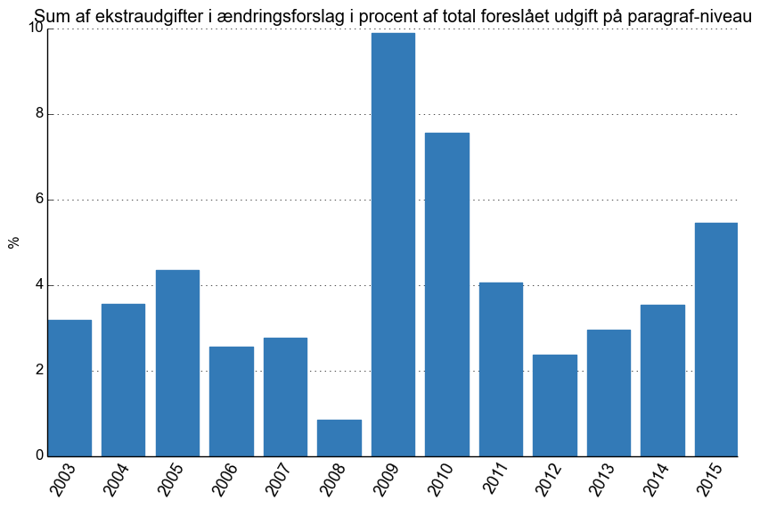
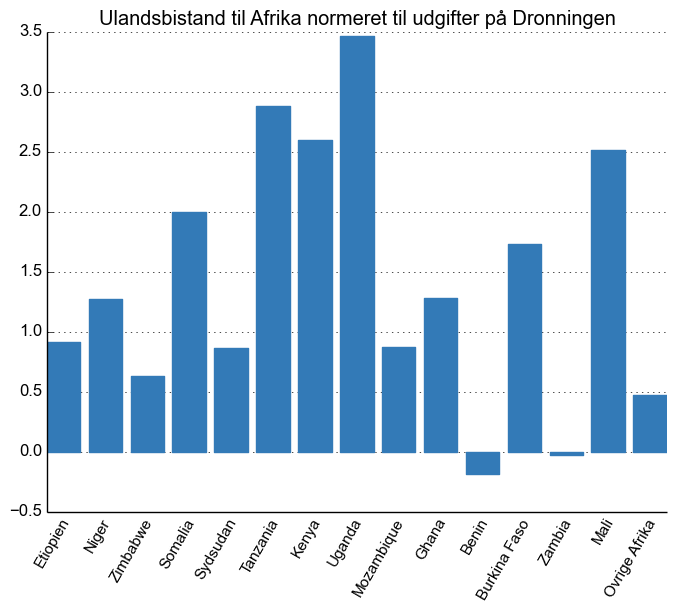
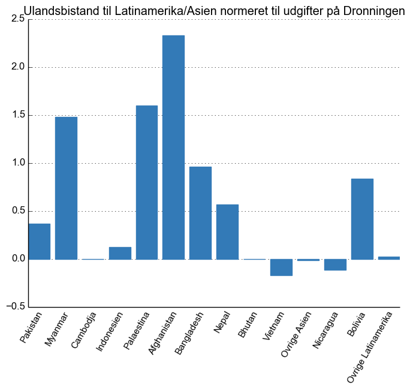

Finanslov 2016
==============

Jeg var i går til [Dataworkshop](http://dk.okfn.org/2015/11/12/dataen-bag-finanslov-2016) sammen med Open Knowledge Danmark hos Information. Vi brugte 3 timer på at se på [tallene](http://www.oes-cs.dk/olapdatabase/finanslov/index.cgi) bag finanslovsforslaget for 2016.

Herunder ses de figurer jeg fik lavet. Den tilhørende kode er ikke så pæn eftersom den hovedsageligt er skrevet i træt tilstand i toget på vej hjem.

Ændringsforslag
---------------
Jeg ville prøve at lave et ca. mål for hvor meget der hvert år har flyttet sig under forhandlingerne af finansloven. Derfor har jeg summeret ekstraudgifterne i ændringsforslagene og sammenhold dem med summen af de samlede foreslåede udgifter. Som det kan ses af figuren nedenfor er der oftest meget få procent der bliver flyttet.

Min første tanke var at summere absolutværdierne af ændringsforslagene, for både at få de positive og negative ændringer med, men da summen af ændringsforslagene ikke er nul for hvert år er det svært at sammenholde på tværs af årene.

Figuren bør opdateres når ændringsforslagene for 2016 offentliggøres.

Dronningen
----------
Et forsøg på at svare på spørgsmålet: **Hvor mange dronninger kan vi forsørge for ulandsbistanden?** Jeg har sammenholdt ulandsbistanden med udgiften til [Dronnigen](http://www.oes-cs.dk/bevillingslove/doctopic.cgi?book=BEVPUBL.FFL16&topic=1&searchtype=3).

De tal der er blevet sammenholdt er summen af: resultat fra 2014, budget for 2015, forslag for 2016 og budgetoverslag for 2017-2019.

